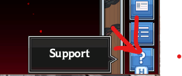
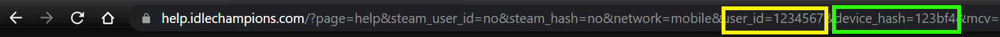
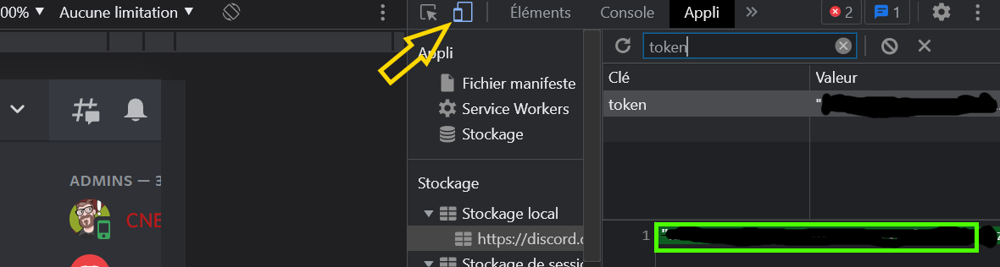

# idlecodes

idlecodes is a batch tool to get codes for idlechampions and send it automatically.

#requirement

you need to have java 16 on your machine : https://corretto.aws/downloads/latest/amazon-corretto-16-x64-windows-jdk.msi

## installation
get idlecodes.zip  
unzip in a folder  
use idlecodes.bat in a terminal (cmd)  

## usage
### normal usage
`idlecodes.bat`
launch idlecodes and get codes from reddit (and discord if set) then send it to idlechampions  

#### options :
`idlecodes.bat -ld 50 -lr 50`
- ld set how many codes to get from discord : max 100 min 1 default 50
- lr set how many codes to get from reddit : max 100 min 1 default 50

### adding an idle champions login 

You can add as many user login as you wish one by one by doing :
`idlecodes.bat idle  some_user_id some_user_hash`

to find your login information :
click on support in the game   
accept going to your browser
on the   
get the user_id and device_hash and put it as parameter
`idlecodes.bat idle 1234567 123bf4`

#### options :

- remove an idle login :
  `idlecodes.bat idle -d 1234567 123bf4`

### adding / replacing a discord token

`idlecodes.bat idle discord some_discord_token`

to get your discord token :  
**you need to be a member ot the idle champions server : https://discord.gg/idlechampions**  
log into discord on chrome
open the developper tools ctrl+maj+i  
set the tool to application (button over yellow arrow)  
in LocalStorge > https://discord.com
search token and copy the token and remove the double quotes  

## Thanks

- The great tool [IdleCombos](https://github.com/dhusemann/idlecombos) for idle champions api  
- [reddit_idlechampions_get_last_loot](https://github.com/rowaasr13/snippets/blob/master/reddit_idlechampions_get_last_loot.js) for the regex patterns
- [discord chat exporter](https://github.com/Tyrrrz/DiscordChatExporter/) for the connection to discord api  

### batch one liner with IdleCombos, discord chat exporter and [jq](https://github.com/stedolan/jq)  

download everything. put it all in the same folder  
open in cmd  
type `DiscordChatExporter.Cli.exe export -c 358044869685673985 -f json -t REPLACE_THIS_BY_YOUR_TOKEN --after 2021-09-29 -o temp.json && jq-win32.exe -r ".messages | reverse[].content  | split(\"\n\")[0]" <temp.json | clip`
open IdleCombos > Tools > redeem codes > paste > send  
done